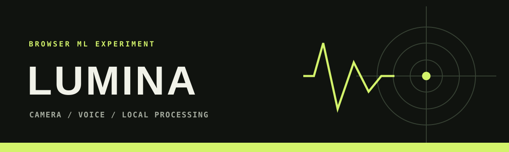
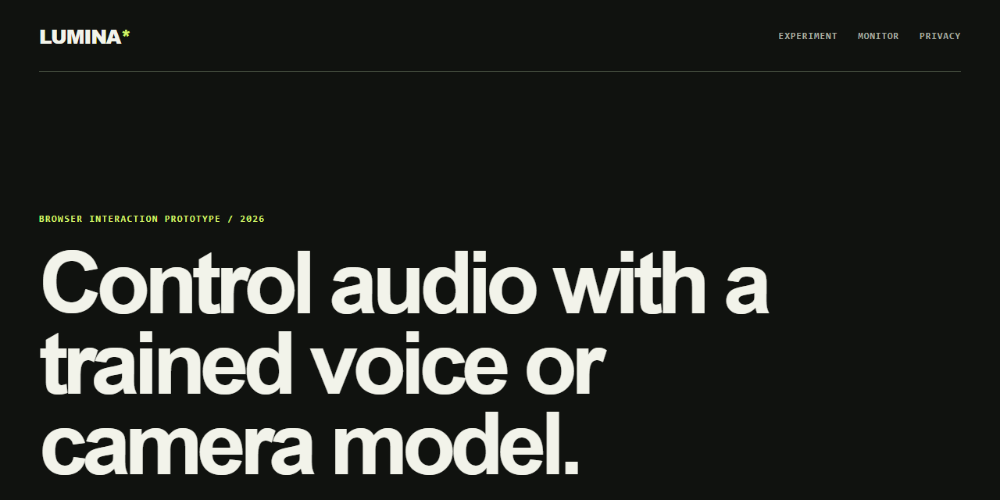

<div align="center">
  
</div>

# LUMINA


LUMINA is a static browser experiment that connects locally hosted Teachable Machine models to camera gestures, voice commands, and audio playback.

**[Open LUMINA on the web](https://lumina.antideploy.com)**



**[Try the experiment](https://lumina.antideploy.com)** · **[Read the privacy notes](https://lumina.antideploy.com/privacy.html)** · **[Report a reproducible problem](https://github.com/DwijKansagara/LUMINA-AI/issues/new/choose)**

[](https://github.com/DwijKansagara/LUMINA-AI/actions/workflows/security.yml)

## What it does

- Loads the image and speech model files stored in `models/`.
- Requests camera or microphone access only after the visitor selects a mode.
- Displays the current model label and confidence value.
- Maps trained play and stop labels to a quiet tone generated with the browser Web Audio API.
- Saves a camera snapshot only after an explicit button press.

The model output is experimental. It should not be used for identity, safety, health, security, or access-control decisions.

## Run locally

Camera and microphone APIs require a secure context. Start a local server instead of opening `index.html` directly:

```powershell
py -m http.server 8000
```

Then open `http://localhost:8000` in a current Chromium, Firefox, or Safari browser and grant only the permission needed for the mode you want to test.

## Structure

```text
models/audio/    Speech Commands model and metadata
models/image/    Teachable Machine image model and metadata
index.html       Accessible page structure
style.css        Responsive visual system
script.js        Permission, inference, media and snapshot logic
```

## Privacy and network use

Camera frames, microphone samples, predictions, and snapshots stay in the browser. The page downloads pinned TensorFlow.js, Teachable Machine, and Speech Commands libraries from jsDelivr. Model files load from the same site that serves the project. The interaction tone is generated locally and requires no audio asset.

The site also includes an aggregate view counter and 20-step appreciation meter. Appreciation progress is remembered with a random, site-specific browser value only after interaction. Privacy, terms, cookie, and refund pages document the site's current behavior.

## Limitations

- Recognition quality depends on the supplied training data, device, lighting, microphone and background noise.
- Browser permission and autoplay policies vary.
- The bundled model assets are prototypes and have not been independently evaluated for accuracy or bias.

Built by [Dwij Kansagara](https://github.com/DwijKansagara).

## Feedback and contributions

Useful reports include the browser, device, selected mode, permission state and exact reproduction steps. Do not attach private recordings or identifiable camera frames. Read [CONTRIBUTING.md](CONTRIBUTING.md) before opening a pull request. If LUMINA is useful for learning browser ML, a GitHub star helps others discover it.

